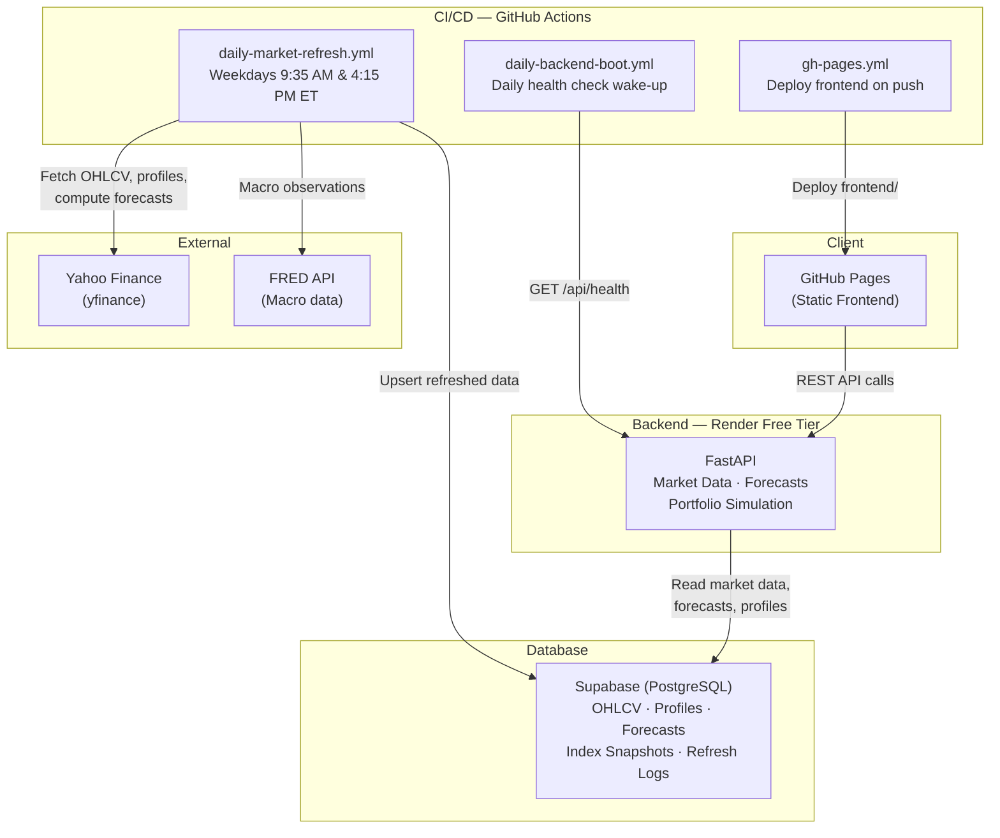

# Foresight


Foresight is a full-stack web application for market intelligence, scenario-based forecasting, portfolio simulation, and financial literacy.

**Live:** [sudip70.github.io/foresight](https://sudip70.github.io/foresight/)

**Demo:**
<p align="center">
  
</p>

---

## Architecture



## Tech Stack

| Layer | Technology |
|-------|-----------|
| Backend | Python 3.11, FastAPI, NumPy |
| Frontend | Vanilla HTML/CSS/JS, Chart.js |
| Database | Supabase (PostgreSQL) |
| Hosting | Render (backend), GitHub Pages (frontend) |
| CI/CD | GitHub Actions |
| ML | PPO/SAC reinforcement learning, surrogate SHAP |

## Features

### Market Overview
- Real-time market index tracking (S&P 500, Nasdaq, Dow Jones, TSX) with proxy ETF fallback
- Interactive index history charts with 20-day moving average (1m / 3m / 6m / 1y / 5y ranges)
- Market sentiment scoring and top opportunity highlights
- 56-ticker universe: 25 stocks, 21 ETFs, 10 crypto assets

### Ticker Forecasts
- Scenario-based price projections (bull / base / bear) with configurable horizons (30–730 days)
- Confidence scoring and risk classification per ticker
- Company profile cards with fundamental metrics (P/E, market cap, dividend yield, sector)
- Forecast change tracking between refreshes
- Interactive forecast chart with scenario bands

### Portfolio Simulator
- Dollar-amount portfolio simulation with adjustable risk tolerance (0–1 scale)
- Multi-asset allocation across stocks, ETFs, and crypto
- Customizable constraints: max crypto weight, max single position, min cash, preferred asset classes
- Trade plan generation with per-ticker buy amounts
- Benchmark comparison (equal-weight, 60/40, all-bond)
- Class-level allocation donut chart with hover tooltips
- Allocation explanations and constraint summaries

### Learn Mode
- Toggle-able educational overlays across all dashboard sections
- Glossary chips with inline definitions for financial terms
- Contextual lessons explaining forecasting methodology, risk concepts, and portfolio theory

### About / Diagnostics
- Data health cards and freshness indicators
- Model status display and refresh history
- Project story and methodology documentation

## API Endpoints

All endpoints are served under the `/api` prefix.

### Health & Metadata
| Method | Path | Description |
|--------|------|-------------|
| `GET` | `/api/health` | Health check with dependency status |
| `GET` | `/api/models` | Model metadata and artifact versions |

### Market Data
| Method | Path | Description |
|--------|------|-------------|
| `GET` | `/api/universe` | Full asset universe (tickers, sectors, asset classes) |
| `GET` | `/api/tickers/{ticker}/profile` | Company profile and fundamental metrics |
| `GET` | `/api/market/indices` | Latest market index snapshots |
| `GET` | `/api/market/indices/{symbol}/history?range=1y` | Index history (1m, 3m, 6m, 1y, 5y) |

### Forecasting
| Method | Path | Description |
|--------|------|-------------|
| `POST` | `/api/forecasts/ticker` | Single-ticker scenario forecast |
| `POST` | `/api/forecasts/market` | Full-market forecast batch |

### Portfolio & Inference
| Method | Path | Description |
|--------|------|-------------|
| `POST` | `/api/portfolio/simulations` | Portfolio simulation with allocation + trade plan |
| `POST` | `/api/inference` | RL-based allocation inference |
| `POST` | `/api/explanations` | Surrogate SHAP explanations for allocations |

### Diagnostics
| Method | Path | Description |
|--------|------|-------------|
| `GET` | `/api/data/refresh/status` | Latest data refresh status and logs |
| `POST` | `/api/backtests` | Historical backtest with rebalancing |

## Project Layout

```
backend/
  app/
    api/routes/       # FastAPI route handlers
    api/schemas.py    # Pydantic request/response models
    core/config.py    # Settings and environment config
    market/           # Forecasting engine, repository, simulation, index refresh
    ml/               # RL environments, policies, artifacts, SHAP, feature engineering
  tests/              # 85 automated tests
frontend/
  api/                # API client, endpoints config
  charts/             # Chart.js forecast and index history charts
  render/             # Section renderers (market, forecast, simulator, diagnostics)
  state/              # Global state store, glossary, literacy definitions
  utils/              # DOM helpers, formatters, validation
config/
  asset_universe.v1.json     # 56-ticker universe definition
  market_indices.v1.json     # Index config with proxy ETF fallback tickers
offline/
  supabase_refresh.py        # Supabase data refresh pipeline
  rebuild_market_data.py     # OHLCV rebuild from Yahoo Finance
  train_ppo_agents.py        # PPO agent training script
scripts/
  refresh_supabase_daily.sh  # Daily refresh wrapper
  boot_backend_daily.sh      # Render cold-start health check
```

## Asset Universe

| Class | Count | Examples |
|-------|-------|---------|
| Stocks | 25 | AAPL, MSFT, GOOGL, NVDA, TSLA, JPM, ... |
| ETFs | 21 | SPY, QQQ, DIA, VTI, GLD, TLT, EWC, ... |
| Crypto | 10 | BTC, ETH, SOL, ADA, XRP, DOGE, ... |

### Market Indices

| Symbol | Index | Provider Symbol | Proxy ETF |
|--------|-------|-----------------|-----------|
| SP500 | S&P 500 | ^GSPC | SPY |
| NASDAQ | Nasdaq Composite | ^IXIC | QQQ |
| DOW | Dow Jones Industrial Average | ^DJI | DIA |
| TSX | S&P/TSX Composite | ^GSPTSE | EWC |

Index history uses a three-tier fallback: Supabase cached proxy ETF data → yfinance live index → yfinance live proxy ETF.

## Local Setup

```bash
python3.11 -m venv .venv
source .venv/bin/activate
pip install --upgrade pip
pip install -r requirements-dev.txt
```

## Running the Backend

```bash
source .venv/bin/activate
uvicorn backend.app.main:app --reload
```

The API is served at `http://localhost:8000` with interactive docs at `/docs`.

## Frontend

The frontend is a static site under `frontend/`. Open `frontend/index.html` locally or deploy to GitHub Pages.

The backend URL is configurable from the in-app Settings panel or via `?apiBase=https://your-backend.example.com`.

## Deployment

### GitHub Pages (Frontend)

The workflow `.github/workflows/gh-pages.yml` deploys the `frontend/` directory. Set **Settings → Pages → Source** to **GitHub Actions**.

The frontend defaults to the Render backend when served from GitHub Pages, and `localhost:8000` for local development.

### Render (Backend)

The `render.yaml` Blueprint creates a free-tier web service with the slim `requirements-render.txt` (FastAPI, uvicorn, NumPy, httpx — no pandas/yfinance/torch).

The hosted service runs in Supabase-first mode:
- Market data, profiles, forecasts, and simulations read from Supabase
- Index snapshots use proxy ETF rows instead of live provider fetches
- Memory stays under the 512 MB free-plan cap

### Supabase (Database)

1. Apply migrations from `supabase/migrations/`
2. Set environment variables:
   ```bash
   export SUPABASE_URL="https://your-project-ref.supabase.co"
   export SUPABASE_SERVICE_ROLE_KEY="your-service-role-key"
   ```
3. Run a full data seed:
   ```bash
   python offline/supabase_refresh.py --mode full
   ```

### Automated Schedules

| Workflow | Schedule | Purpose |
|----------|----------|---------|
| `daily-market-refresh.yml` | Weekdays 13:35 & 20:15 UTC | Refresh OHLCV, profiles, forecasts, indices |
| `daily-backend-boot.yml` | Daily 12:00 UTC | Wake Render free-tier with health check |
| `gh-pages.yml` | On push to main | Deploy frontend to GitHub Pages |

The refresh pipeline upserts: `asset_universe`, `market_ohlcv_daily`, `asset_profile_snapshots`, `macro_observations`, `market_index_snapshots`, `forecast_snapshots`, and refresh run logs.

## Backend Configuration

| Variable | Default | Description |
|----------|---------|-------------|
| `SUPABASE_URL` | — | Supabase project URL |
| `SUPABASE_SERVICE_ROLE_KEY` | — | Supabase service role key |
| `FORESIGHT_MARKET_DATA_PROVIDER` | `yfinance` | Market data source (`yfinance` or `supabase_proxy`) |
| `FORESIGHT_REQUIRE_SUPABASE` | `false` | Fail fast if Supabase is unavailable |
| `FORESIGHT_LOAD_ARTIFACT_ENGINE` | `true` | Load RL artifact engine on startup |
| `FORESIGHT_LAZY_LOAD_ARTIFACT_ENGINE` | `false` | Lazy-load artifact engine on first request |
| `FORESIGHT_ARTIFACT_POLICY_MODE` | `auto` | Policy mode (`auto`, `signal`, `ppo`, `sac`) |
| `FORESIGHT_MARKET_INDEX_AUTO_REFRESH` | `false` | Fetch index snapshots on startup |
| `FRED_API_KEY` | — | FRED API key for macro data (offline jobs) |

## Rate Limiting

The backend enforces per-IP rate limiting: 60 requests per 60-second window. Stale entries are cleaned every 5 minutes. Clients receive HTTP 429 with a `Retry-After` header when throttled.

## Tests

```bash
source .venv/bin/activate
pytest backend/tests/
```

85 tests covering API contracts, forecast logic, simulation allocation, explainability, artifact validation, and configuration. Tests use synthetic fixture artifacts and fixed-weight policies — no production model or network calls required.

## Notes

- FastAPI is the only runtime entrypoint
- GitHub Pages serves the frontend as static assets
- Render serves the backend on the free tier
- No secrets are hardcoded — all credentials come from environment variables
